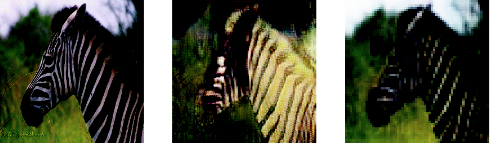
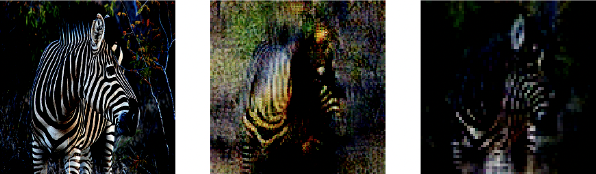
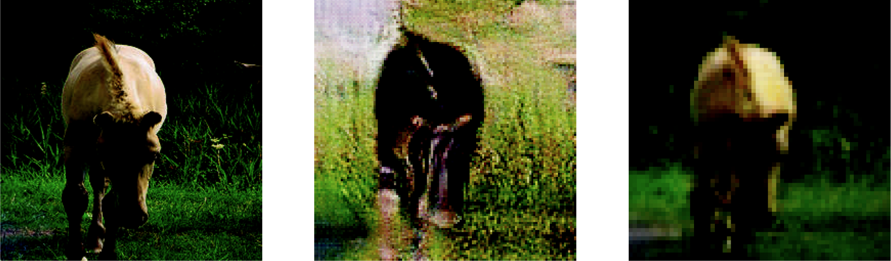
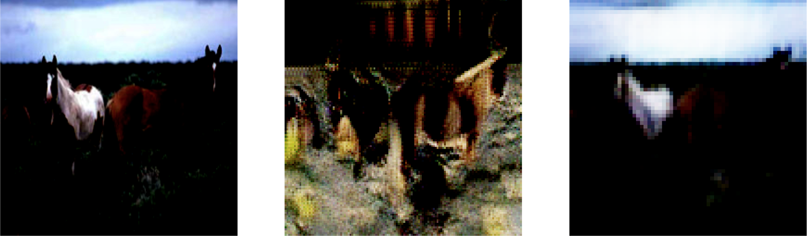
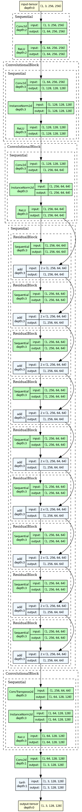
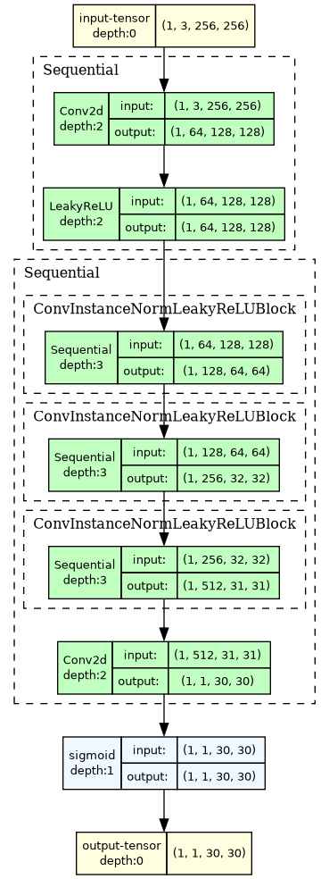

# CycleGAN

[Inspiration Source](https://medium.com/@chilldenaya/cyclegan-introduction-pytorch-implementation-5b53913741ca)

The main change done to the network was the reducing of an upsampling layer. This change gave the most significant impovement. It made the discriminator get a 20% improvement in accuracy.
Now, the images have the following sizes:
```
input (3x256x256) -> fake generated image (3x128x128) -> fake cycled image (3x64x64)
```

Results:






Architectures: \
Generator:
[Generator](generator.png) |
Discriminator:
[Discriminator](discriminator.png)

Generator             |  Discriminator
:--------------------:|:--------------------:
  |  
